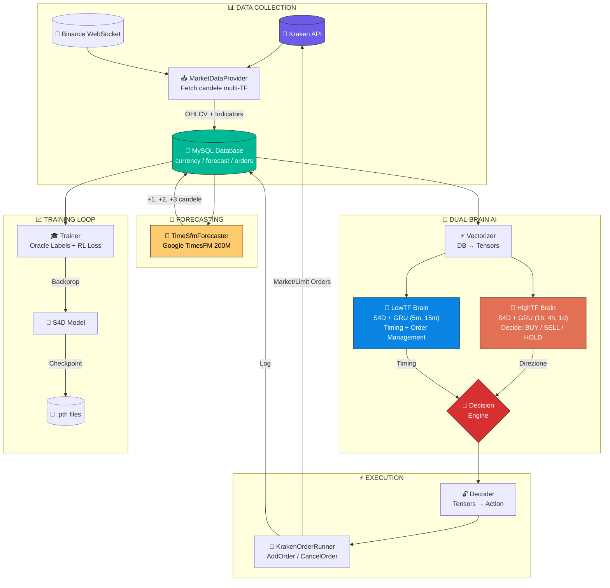
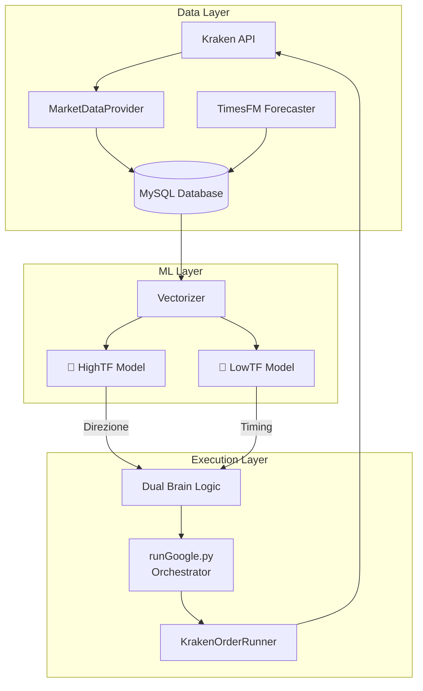
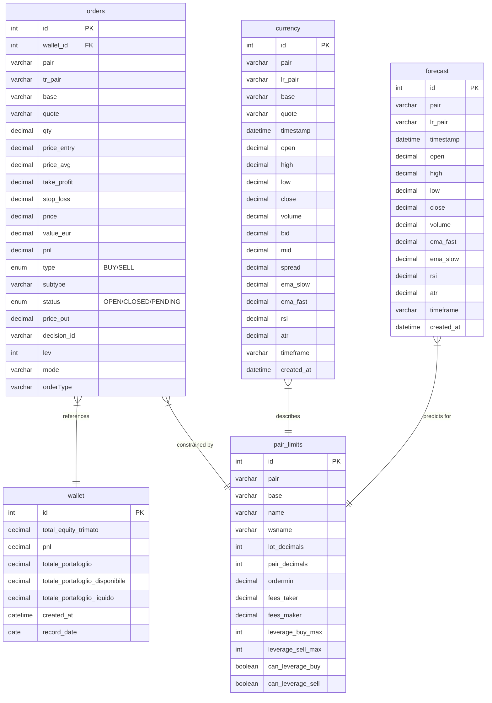
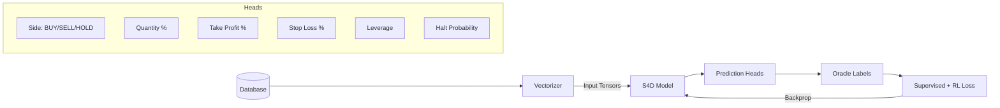

<div align="center">

# 🤖 TradeView Analytics - AI Trading Bot

**Crypto Trading Bot con Dual-Brain Architecture (LowTF + HighTF)**

[](https://python.org)
[](https://pytorch.org)
[](https://kraken.com)
[]()

</div>

---

## �️ Project Overview Diagram



---

## �📋 Indice

- [Overview](#-overview)
- [Architettura Sistema](#-architettura-sistema)
- [Struttura Cartelle](#-struttura-cartelle)
- [File Principali (Dettagliato)](#-file-principali-dettagliato)
- [Flow di Esecuzione](#-flow-di-esecuzione)
- [Setup e Installazione](#-setup-e-installazione)
- [Changelog](#-changelog)

---

## 🎯 Overview

Trading bot automatizzato per criptovalute su **Kraken** con:

| Feature | Descrizione |
|---------|-------------|
| 🧠 **Dual-Brain** | Due modelli ML separati: **HighTF** (strategia 1h+) e **LowTF** (esecuzione 5m-15m) |
| 🔮 **Forecasting** | Predizioni multi-step con **TimesFM** (Google) su candele future |
| 📊 **S4D Architecture** | State Space Model (precursore di Mamba) per sequenze temporali |
| ⚡ **RL Training** | Reinforcement Learning con simulazione PnL per ottimizzazione profitto |
| 🔄 **Live Trading** | Esecuzione ordini reali via Kraken API con gestione TP/SL dinamica |

---

## 🏗 Architettura Sistema



### Dual-Brain Logic

| Brain | Timeframe | Responsabilità |
|-------|-----------|----------------|
| **HighTF** | 1h, 4h, 1d | Decide **direzione** (BUY/SELL/HOLD) ogni 30-60 minuti |
| **LowTF** | 5m, 15m | **Timing** esecuzione + gestione ordini aperti |

---

## 💾 Database Schema

Schema completo delle tabelle MySQL (vedi `db/DatabaseManager.py`):

### 📊 Panoramica Tabelle

| Tabella | Descrizione | Relazioni |
|---------|-------------|-----------|
| **`orders`** | Registro ordini aperti/chiusi con PnL e parametri trading | → `wallet`, → `pair_limits` |
| **`wallet`** | Snapshot periodici equity e bilancio account Kraken | ← `orders` |
| **`currency`** | Candele OHLCV storiche + indicatori tecnici per TF | → `pair_limits` |
| **`pair_limits`** | Metadati Kraken per ogni coppia (leva, fees, limiti) | ← `orders`, ← `currency`, ← `forecast` |
| **`forecast`** | Predizioni candele future da TimesFM/Chronos | → `pair_limits` |

---

<details>
<summary><b>📦 orders</b> — Registro Ordini (~22 colonne)</summary>

| Colonna | Tipo | Descrizione |
|---------|------|-------------|
| `id` | INT (PK) | ID auto-incrementante ordine |
| `wallet_id` | INT (FK) | Riferimento snapshot wallet al momento dell'ordine |
| `pair` | VARCHAR | Coppia trading (es. `BTCEUR`) |
| `tr_pair` | VARCHAR | Pair Kraken per API (es. `XXBTZEUR`) |
| `base` | VARCHAR | Asset base (es. `BTC`) |
| `quote` | VARCHAR | Asset quote (es. `EUR`) |
| `qty` | DECIMAL | Quantità base asset |
| `price_entry` | DECIMAL | Prezzo di ingresso |
| `price_avg` | DECIMAL | Prezzo medio esecuzione (se parziale) |
| `take_profit` | DECIMAL | Prezzo target TP |
| `stop_loss` | DECIMAL | Prezzo target SL |
| `price` | DECIMAL | Prezzo corrente/ultimo |
| `value_eur` | DECIMAL | Valore posizione in EUR |
| `pnl` | DECIMAL | Profit & Loss realizzato |
| `type` | ENUM | Direzione: `BUY`, `SELL` |
| `subtype` | VARCHAR | Sottotipo ordine (es. `LIMIT`, `MARKET`) |
| `status` | ENUM | Stato: `OPEN`, `CLOSED`, `PENDING`, `CANCELLED` |
| `price_out` | DECIMAL | Prezzo di uscita (se chiuso) |
| `decision_id` | VARCHAR | ID decisione AI per tracing |
| `lev` | INT | Leva applicata (2, 3, 4, 5) |
| `mode` | VARCHAR | Modalità: `TEST`, `LIVE` |
| `orderType` | VARCHAR | Tipo ordine Kraken (es. `limit`, `market`) |

</details>

<details>
<summary><b>💰 wallet</b> — Snapshot Bilancio (~8 colonne)</summary>

| Colonna | Tipo | Descrizione |
|---------|------|-------------|
| `id` | INT (PK) | ID auto-incrementante snapshot |
| `total_equity_trimato` | DECIMAL | Equity totale (balance + unrealized PnL) |
| `pnl` | DECIMAL | PnL realizzato nel periodo |
| `totale_portafoglio` | DECIMAL | Valore totale portafoglio |
| `totale_portafoglio_disponibile` | DECIMAL | Margine disponibile per nuovi ordini |
| `totale_portafoglio_liquido` | DECIMAL | Cash disponibile (non in posizione) |
| `created_at` | DATETIME | Timestamp creazione record |
| `record_date` | DATE | Data snapshot per aggregazione |

</details>

<details>
<summary><b>📈 currency</b> — Candele OHLCV (~21 colonne)</summary>

| Colonna | Tipo | Descrizione |
|---------|------|-------------|
| `id` | INT (PK) | ID auto-incrementante candela |
| `pair` | VARCHAR | Coppia trading |
| `lr_pair` | VARCHAR | Pair Kraken per API |
| `base` | VARCHAR | Asset base |
| `quote` | VARCHAR | Asset quote (sempre `EUR`) |
| `timestamp` | DATETIME | Timestamp apertura candela |
| `open` | DECIMAL | Prezzo apertura |
| `high` | DECIMAL | Prezzo massimo |
| `low` | DECIMAL | Prezzo minimo |
| `close` | DECIMAL | Prezzo chiusura |
| `volume` | DECIMAL | Volume scambiato |
| `bid` | DECIMAL | Best bid price |
| `mid` | DECIMAL | Prezzo mid (bid+ask)/2 |
| `spread` | DECIMAL | Spread bid-ask |
| `ema_slow` | DECIMAL | EMA lenta (21 periodi) |
| `ema_fast` | DECIMAL | EMA veloce (9 periodi) |
| `ats` | DECIMAL | Average True Spread |
| `rsi` | DECIMAL | RSI (14 periodi) |
| `stp` | DECIMAL | Stop indicator |
| `atr` | DECIMAL | ATR (14 periodi) |
| `timeframe` | VARCHAR | Timeframe: `1m`, `5m`, `15m`, `1h`, `4h`, `1d` |
| `created_at` | DATETIME | Timestamp inserimento DB |

</details>

<details>
<summary><b>⚙️ pair_limits</b> — Metadati Coppie Kraken (~17 colonne)</summary>

| Colonna | Tipo | Descrizione |
|---------|------|-------------|
| `id` (pld) | INT (PK) | ID auto-incrementante |
| `pair` | VARCHAR | Coppia trading (es. `BTCEUR`) |
| `base` | VARCHAR | Asset base |
| `name` | VARCHAR | Nome display coppia |
| `wsname` | VARCHAR | Nome WebSocket |
| `lot_decimals` | INT | Decimali per quantità ordine |
| `pair_decimals` | INT | Decimali per prezzo |
| `ordermin` | DECIMAL | Quantità minima ordine |
| `fee_volume_currency` | VARCHAR | Valuta per calcolo fee volume |
| `fees_taker` | DECIMAL | Fee taker (%) |
| `fees_maker` | DECIMAL | Fee maker (%) |
| `leverage_buy` | VARCHAR | Leve disponibili per BUY (es. `2,3,4,5`) |
| `leverage_sell` | VARCHAR | Leve disponibili per SELL |
| `leverage_buy_max` | INT | Leva massima BUY |
| `leverage_sell_max` | INT | Leva massima SELL |
| `can_leverage_buy` | BOOLEAN | Flag se leva BUY abilitata |
| `can_leverage_sell` | BOOLEAN | Flag se leva SELL abilitata |

</details>

<details>
<summary><b>🔮 forecast</b> — Predizioni TimesFM (~20 colonne)</summary>

| Colonna | Tipo | Descrizione |
|---------|------|-------------|
| `id` | INT (PK) | ID auto-incrementante predizione |
| `pair` | VARCHAR | Coppia trading |
| `lr_pair` | VARCHAR | Pair Kraken per API |
| `timestamp` | DATETIME | Timestamp candela predetta |
| `quote` | VARCHAR | Asset quote |
| `open` | DECIMAL | Prezzo apertura predetto |
| `high` | DECIMAL | Prezzo massimo predetto |
| `low` | DECIMAL | Prezzo minimo predetto |
| `close` | DECIMAL | Prezzo chiusura predetto |
| `volume` | DECIMAL | Volume predetto |
| `bid` | DECIMAL | Bid predetto |
| `mid` | DECIMAL | Mid predetto |
| `spread` | DECIMAL | Spread predetto |
| `ema_fast` | DECIMAL | EMA veloce predetta |
| `ema_slow` | DECIMAL | EMA lenta predetta |
| `rsi` | DECIMAL | RSI predetto |
| `stp` | DECIMAL | Stop indicator predetto |
| `atr` | DECIMAL | ATR predetto |
| `timeframe` | VARCHAR | Timeframe della predizione |
| `created_at` | DATETIME | Timestamp generazione forecast |

</details>

---

### 🗺️ Entity Relationship Diagram



### 📝 Note per Sviluppatori

> [!TIP]
> **Query comuni per debug**:
> - Ultimi ordini: `SELECT * FROM orders ORDER BY id DESC LIMIT 10;`
> - Candele recenti: `SELECT * FROM currency WHERE pair='BTCEUR' AND timeframe='1h' ORDER BY timestamp DESC LIMIT 50;`
> - Forecast attivi: `SELECT * FROM forecast WHERE timestamp > NOW() ORDER BY timestamp;`

> [!IMPORTANT]
> **Indici chiave per performance**:
> - `currency`: Indice composito su `(pair, timeframe, timestamp)`
> - `forecast`: Indice su `(pair, timeframe, timestamp)`
> - `orders`: Indice su `(status, pair)`

---

## 📁 Struttura Cartelle

```
tradeview-analytics-db/
│
├── 📂 trading/                    # 🧠 Core ML & Training
│   ├── TrmAgent.py                # Architettura S4D Neural Network
│   ├── Trainer.py                 # Training LowTF (60K+ lines)
│   ├── TrainerUp.py               # Training HighTF
│   ├── Vectorizer.py              # Data → Tensor conversion
│   ├── Decoder.py                 # Output decoding utilities
│   ├── RLReward.py                # Reinforcement Learning rewards
│   └── KrakenOrderRunner.py       # Esecuzione ordini live
│
├── 📂 db/                         # 💾 Database & API Layer
│   ├── DatabaseManager.py         # MySQL CRUD operations
│   ├── MarketDataProvider.py      # Kraken market data fetching
│   ├── KrakenManager.py           # Portfolio & positions management
│   ├── KrakenOrders.py            # Order placement logic
│   ├── TimeSfmForecaster.py       # TimesFM forecast generation
│   ├── ChronosForecaster.py       # Amazon Chronos (alternativo)
│   └── finnhub.py                 # Finnhub API integration
│
├── 📂 utils/                      # 🛠 Utility Functions
│   └── plotting.py                # Training loss visualization
│
├── 📂 tools/                      # 🔧 Development Tools
│   ├── codex_promptify.py         # Code prompt generation
│   ├── codex_review_impl.py       # Implementation review
│   └── codex_review_plan.py       # Plan review
│
├── 📂 tests/                      # ✅ Unit Tests
│   ├── test_plotting.py           # Plotting tests
│   └── test_rl_reward.py          # RL reward tests
│
├── 📂 server/                     # 🌐 Express Backend (TypeScript)
│   ├── index.ts                   # Server entry point
│   ├── db.ts                      # DB connection
│   └── types.d.ts                 # Type definitions
│
├── 📂 services/                   # 📡 Frontend Services
│   └── dataService.ts             # API client
│
├── 📂 components/                 # 🎨 React UI Components
│   ├── ChartComponent.tsx         # Candlestick charts
│   ├── ForecastChart.tsx          # Forecast visualization
│   ├── ForecastDashboard.tsx      # Main dashboard
│   ├── PortfolioModal.tsx         # Portfolio modal
│   ├── Sidebar.tsx                # Navigation sidebar
│   └── TimeframeSelector.tsx      # TF selector
│
├── 📂 model/                      # 💾 Trained Models (gitignored)
│   ├── trainerBest.pth            # Best LowTF checkpoint
│   └── trainerUpPnl.pth           # Best HighTF checkpoint
│
├── 📂 .agent/                     # 🤖 AI Agent Config
│   ├── workflows/                 # Automated workflows
│   └── schemas/                   # JSON schemas
│
├── 🗎 runGoogle.py                # ⭐ MAIN: Dual-brain trading loop
├── 🗎 mainLoop.py                 # ⭐ Data collector & forecaster
├── 🗎 RunTrainingGpu.py           # Training LowTF model
├── 🗎 RunTrainingGpuUp.py         # Training HighTF model
├── 🗎 main.py                     # Legacy entry point
├── 🗎 runChatGpt.py               # ChatGPT-based trading (legacy)
├── 🗎 test_input_comparison.py    # Debug: train vs prod comparison
│
├── 🗎 requirements.txt            # Python dependencies
├── 🗎 package.json                # Node.js dependencies
├── 🗎 .env                        # Environment variables
└── 🗎 dual_brain_state.json       # Runtime state persistence
```

---

## 📄 File Principali (Dettagliato)

### 🚀 Entry Points

| File | Descrizione | Comando |
|------|-------------|---------|
| `runGoogle.py` | **Trading loop principale** con dual-brain | `python runGoogle.py` |
| `mainLoop.py` | **Data collector** + forecast scheduler | `python mainLoop.py` |
| `RunTrainingGpu.py` | Training modello **LowTF** | `python RunTrainingGpu.py` |
| `RunTrainingGpuUp.py` | Training modello **HighTF** | `python RunTrainingGpuUp.py` |

---

### 🧠 trading/ - Core ML

<details>
<summary><b>📄 TrmAgent.py</b> — Neural Network S4D Architecture (~366 linee)</summary>

**Descrizione**: Implementa l'architettura **S4D (Structured State Space)** + **GRU** per trading multi-timeframe. È il precursore di Mamba con complessità O(n log n).

| Classe/Funzione | Descrizione |
|-----------------|-------------|
| `RunningNorm` | Normalizzazione on-the-fly per stabilità training |
| `S4DLayer` | Layer State Space con kernel FFT per dipendenze lunghe |
| `S4Block` | S4D + FFN block (simile a Transformer block) |
| `MultiTimeframeTRM` | **Modello principale**: processa multi-TF, estrae features, genera predizioni |
| `MultiTimeframeTRM.extract_features()` | Estrae context tokens dai vari timeframe usando S4 |
| `MultiTimeframeTRM.think()` | Step ricorrente GRU + Residual (il "pensiero") |
| `MultiTimeframeTRM.get_heads_dict()` | Restituisce predizioni: side, qty, tp, sl, lev, halt_prob |
| `NewTinyRecursiveModel` | Modello legacy per backward compatibility |

**Flow interno**:
```
Input Dict[tf → Tensor] → S4DLayer per TF → Concat → GRU Brain → 6 Prediction Heads
```

</details>

<details>
<summary><b>📄 Trainer.py</b> — LowTF Training Logic (~1254 linee)</summary>

**Descrizione**: Trainer completo per modello **LowTF** con Oracle labels, RL loss, e smart close probability.

| Classe/Funzione | Descrizione |
|-----------------|-------------|
| `TradingTrainer.__init__()` | Setup modello, optimizer AdamW, RL reward manager |
| `_compute_clarity_score()` | Calcola quanto è "chiara" la decisione (margine tra azioni) |
| `_compute_smart_close_probability()` | Probabilità chiusura basata su PnL%, TP progress, momentum |
| `_simulate_clarity_pnl()` | Simula PnL per BUY/SELL/HOLD su candele future |
| `generate_fake_order()` | Genera ordine finto per training su scenari di chiusura |
| `generate_oracle_label()` | **Core**: calcola target ideali per tutte le heads |
| `train_step()` | Step completo: forward → loss → backprop → RL adjustment |
| `_compute_pnl_reward()` | Simula PnL reale con fee, leva, TP/SL |
| `_compute_rl_loss_multi_head()` | Loss RL per tutte le heads (non solo side) |
| `save_checkpoint()` | Salva modello su disco |

**Oracle Label Flow**:
```
Future Candles → Simula BUY/SELL/HOLD → Calcola TP/SL ottimali → Target Tensors
```

</details>

<details>
<summary><b>📄 TrainerUp.py</b> — HighTF Training Logic (~972 linee)</summary>

**Descrizione**: Versione ottimizzata del Trainer per decisioni **strategiche** su timeframe alti.

| Classe/Funzione | Descrizione |
|-----------------|-------------|
| `TradingTrainer.__init__()` | Setup con parametri ottimizzati per HighTF |
| `_compute_pnl_reward()` | Simulazione PnL con logica specifica per 1h+ |
| `_compute_smart_close_probability()` | Threshold più alti (2.5% min) per coprire fees con leva |
| `generate_fake_order()` | Genera ordini fake con durata più lunga |
| `generate_oracle_label()` | Oracle ottimizzato per decisioni meno frequenti |
| `_estimate_atr_pct()` | Stima ATR% per sizing dinamico TP/SL |
| `train_step()` | Training step con RL loss multi-head |

</details>

<details>
<summary><b>📄 Vectorizer.py</b> — Data → Tensor Conversion (~246 linee)</summary>

**Descrizione**: Converte dati DB (candele, ordini, forecast) in tensori PyTorch normalizzati.

| Classe/Funzione | Descrizione |
|-----------------|-------------|
| `VectorizerConfig` | Dataclass con configurazione colonne e timeframe |
| `DataVectorizer.__init__()` | Calcola dimensioni vettori per candle/order/forecast |
| `_safe_float()` | Conversione sicura a float con default |
| `_hash_string()` | Hash CRC32 per stringhe (pair, status, etc.) |
| `_encode_time()` | Encoding ciclico tempo (sin/cos hour, day, month) |
| `_vectorize_row()` | Vettorizza singola riga con normalizzazione |
| `vectorize()` | **Main**: Dict TF → Tensors per modello + ref_price |

**Output**:
```python
{
  "5m": Tensor[seq_len, candle_dim],
  "15m": Tensor[seq_len, candle_dim],
  "1h": Tensor[seq_len, candle_dim],
  "order": Tensor[1, order_dim],
  "static": Tensor[1, static_dim]
}
```

</details>

<details>
<summary><b>📄 Decoder.py</b> — Output Decoding (~206 linee)</summary>

**Descrizione**: Traduce output tensori del modello in azioni trading valide per l'exchange.

| Classe/Funzione | Descrizione |
|-----------------|-------------|
| `ActionDecoder.__init__()` | Setup con ref_price, pair_limits, order esistente |
| `decode()` | **Main**: heads dict → action dict valido per Kraken |
| `print_action()` | Stampa formattata dell'azione decoded |
| `_snap_leverage()` | Aggancia leva grezza ai valori validi (2, 3, 4, 5) |

**Output Action**:
```python
{
  "side": "BUY|SELL|HOLD",
  "qty_eur": 15.0,
  "tp_pct": 0.025,
  "sl_pct": 0.015,
  "leverage": "3:1",
  "order_type": "LIMIT",
  "halt_prob": 0.3
}
```

</details>

<details>
<summary><b>📄 KrakenOrderRunner.py</b> — Order Execution (~418 linee)</summary>

**Descrizione**: Traduce azioni del modello in chiamate API Kraken reali con retry logic.

| Classe/Funzione | Descrizione |
|-----------------|-------------|
| `KrakenOrderRunner.__init__()` | Setup API krakenex + pair map |
| `_normalize_leverage()` | Formatta leva "X:1" per API Kraken |
| `_resolve_pair()` | Mappa alias → pair Kraken ufficiale |
| `build_bodies()` | Costruisce payload AddOrder con TP/SL embedded |
| `_pair_min_volume()` | Min volume per pair da AssetPairs |
| `_pair_min_cost()` | Min cost in quote currency |
| `_pair_max_leverage()` | Max leva disponibile per side |
| `_available_amounts()` | Saldi disponibili per trading |
| `_ticker_mid_price()` | Prezzo mid corrente |
| `cancel_order()` | Cancella ordine esistente |
| `execute_bodies()` | **Main**: esegue AddOrder/CancelOrder con gestione errori |

**Error Handling**: Retry automatico con backoff, log errori su file.

</details>

<details>
<summary><b>📄 RLReward.py</b> — RL Reward Manager (~60 linee)</summary>

**Descrizione**: Manager per calcolo reward Reinforcement Learning basato su PnL simulato.

| Classe/Funzione | Descrizione |
|-----------------|-------------|
| `PnlRewardManager.__init__()` | Setup con scaling factor |
| `compute_reward()` | Calcola reward normalizzato da PnL raw |
| `normalize_reward()` | Scala reward in range [-1, 1] |

</details>

---

### 💾 db/ - Database Layer

<details>
<summary><b>📄 DatabaseManager.py</b> — MySQL Operations (~660 linee)</summary>

**Descrizione**: CRUD completo per tutte le tabelle MySQL: currency, forecast, orders, wallet, pair_limits.

| Funzione | Descrizione |
|----------|-------------|
| `__init__()` | Connessione MySQL con credenziali da .env |
| `insert_wallet()` | Inserisce snapshot wallet Kraken |
| `insert_orders()` | Inserisce ordini aperti/chiusi |
| `insert_currency_data()` | Inserisce candele con UPSERT |
| `insert_all_pairs()` | Inserisce/aggiorna pair_limits |
| `updateOrder()` | Aggiorna campi specifici ordine |
| `get_candles_with_offset()` | Recupera N candele con offset |
| `get_candles_before_date()` | Candele prima di timestamp (per training) |
| `get_last_candles()` | Ultime N candele per pair/TF |
| `_sanitize_and_update_order()` | Bonifica ordini con campi NULL |
| `get_trading_context()` | **Main**: recupera contesto completo per inferenza |
| `get_trading_context_training()` | Contesto con pivot timestamp per training |

</details>

<details>
<summary><b>📄 MarketDataProvider.py</b> — Data Fetching (~599 linee)</summary>

**Descrizione**: Fetch dati da Kraken API, calcolo indicatori tecnici, caching.

| Funzione | Descrizione |
|----------|-------------|
| `__init__()` | Setup krakenex + caricamento AssetPairs |
| `_load_kraken_asset_pairs()` | Cache metadati coppie (leva, min order, etc.) |
| `getPair()` | Recupera info singola coppia |
| `_calculate_indicators()` | Calcola EMA(9,21), RSI(14), ATR(14) |
| `getCandles()` | **Main**: fetch candele + indicatori → lista dict |
| `_fetch_kraken_now()` | Prezzo istantaneo da Ticker |
| `_fetch_kraken_history()` | Storico OHLCV da OHLC endpoint |
| `getAllPairs()` | Lista tutte coppie EUR con leva |
| `stream_binance_market()` | WebSocket Binance per tick-by-tick |

**Indicatori Calcolati**: EMA9, EMA21, RSI14, ATR14, Bid, Ask, Mid, Spread

</details>

<details>
<summary><b>📄 KrakenManager.py</b> — Portfolio Management (~458 linee)</summary>

**Descrizione**: Gestione portfolio Kraken: posizioni, ordini aperti, equity.

| Funzione | Descrizione |
|----------|-------------|
| `__init__()` | Setup API + cache dati pubblici |
| `get_open_orders()` | Ordini aperti (pending) |
| `get_open_positions()` | Posizioni aperte (marginate) |
| `_get_trades_history()` | Storico trade eseguiti |
| `get_normalized_portfolio()` | **Main**: unifica ordini + posizioni |
| `get_portfolio_summary()` | Calcola equity, margin, unrealized PnL |
| `print_pretty_report()` | Report formattato per debug |

</details>

<details>
<summary><b>📄 TimeSfmForecaster.py</b> — TimesFM Predictions (~310 linee)</summary>

**Descrizione**: Wrapper per **Google TimesFM 200M** per predizioni candele future.

| Funzione | Descrizione |
|----------|-------------|
| `__init__()` | Caricamento modello TimesFM (GPU/CPU) |
| `predict_candles()` | **Main**: genera +1, +2, +3 candele future |
| `_safe_array()` | Gestisce NaN/Inf nei dati |
| `get_log_ret()` | Calcola log returns per normalizzazione |
| `denorm()` | Denormalizza predizioni |
| `_parse_timeframe_pandas()` | Converte TF string → pandas frequency |

**Output Forecast**:
```python
[
  {"timestamp": t+1, "open": 50100, "high": 50200, "low": 50000, "close": 50150, "rsi": 55},
  {"timestamp": t+2, ...},
  {"timestamp": t+3, ...}
]
```

</details>

---

## 🔄 Flow di Esecuzione

### 1️⃣ Data Collection (`mainLoop.py`)

```mermaid
sequenceDiagram
    participant LOOP as Main Loop
    participant MDP as MarketDataProvider
    participant DB as Database
    participant TSF as TimeSfmForecaster

    loop Ogni 5 min
        LOOP->>MDP: Fetch candele 5m, 1m
        MDP->>DB: Insert currency data
    end

    loop Ogni 15 min
        LOOP->>MDP: Fetch candele 15m
        LOOP->>TSF: Generate forecast (async)
        TSF->>DB: Insert forecast data
    end

    loop Ogni 1h
        LOOP->>MDP: Fetch 1h, 4h, 1d
        LOOP->>TSF: Generate 1h forecast
    end
```

### 2️⃣ Trading Loop (`runGoogle.py`)

```mermaid
sequenceDiagram
    participant LOOP as Main Loop
    participant HIGH as HighTF Brain
    participant LOW as LowTF Brain
    participant DB as Database
    participant KR as Kraken

    loop Ogni 30-60 min
        LOOP->>DB: Get context (candele + forecast)
        LOOP->>HIGH: Think → BUY/SELL/HOLD
        HIGH-->>LOOP: Direzione strategica
    end

    loop Ogni 5 min
        LOOP->>DB: Get open positions
        loop Per ogni posizione
            LOOP->>LOW: Think → HOLD/CLOSE
            LOW-->>LOOP: Decisione
            alt Close Order
                LOOP->>KR: Execute close
            end
        end
    end
```

### 3️⃣ Model Training



---

## ⚙️ Setup e Installazione

### Prerequisiti

- Python 3.10+
- CUDA 11.8+ (per training GPU)
- MySQL Server
- Node.js 18+ (per UI)

### 1. Installazione Python

```bash
# Crea virtual environment
python -m venv .venv
.venv\Scripts\activate.ps1  # Windows
.venv_amd_therock\Scripts\activate.ps1  # Windows
# Installa dipendenze
pip install -r requirements.txt
```

### 2. Configurazione Environment

Crea `.env` con:

```env
# Database
MYSQL_HOST=localhost
MYSQL_USER=root
MYSQL_PASSWORD=your_password
MYSQL_DATABASE=tradeview

# Kraken API
KRAKEN_KEY=your_api_key
KRAKEN_SECRET=your_api_secret

# Trading Mode
TRADING_MODE=TEST  # TEST o LIVE
```

### 3. Avvio Sistema

```bash
# Terminal 1: Data Collector
python mainLoop.py

# Terminal 2: Trading Bot
python runGoogle.py
```

### 4. Training Modello

```bash
# low tf
python RunTrainingGpu.py

# high tf
python RunTrainingGpuUp.py
```
---

## 📝 Changelog

> **Formato**: Aggiungi nuove entry in cima con data e descrizione

| Data | Versione | Cambiamenti |
|------|----------|-------------|
| 2025-12-27 | v1.1.0 | 📄 README espansa con diagrammi e dettagli funzioni per ogni file |
| 2025-12-27 | v1.0.0 | 📄 Creazione README completa con documentazione progetto |
| 2025-12-26 | - | 🔧 Fix RL credit assignment per multi-head training |
| 2025-12-26 | - | 📈 Tuning profit-taking logic (2.5% min threshold) |
| 2025-12-25 | - | 📊 Aggiunto plotting training loss |
| 2025-12-24 | - | 🧠 Migrazione da Transformer a S4D architecture |
| 2025-12-23 | - | 🔄 Implementazione dual-brain (HighTF + LowTF) |

---

## 🤝 Come Contribuire

1. **Prima di modificare**: Leggi questa sezione e la struttura file
2. **Dopo ogni implementazione**: Aggiorna il [Changelog](#-changelog) con:
   - Data
   - Emoji categoria (🔧 fix, 📈 feature, 🧠 ML, 📄 docs)
   - Descrizione breve
3. **File principali da testare**: `runGoogle.py`, `Trainer.py`, `TrmAgent.py`

---

<div align="center">

**Made with ❤️ for crypto trading**

</div>
